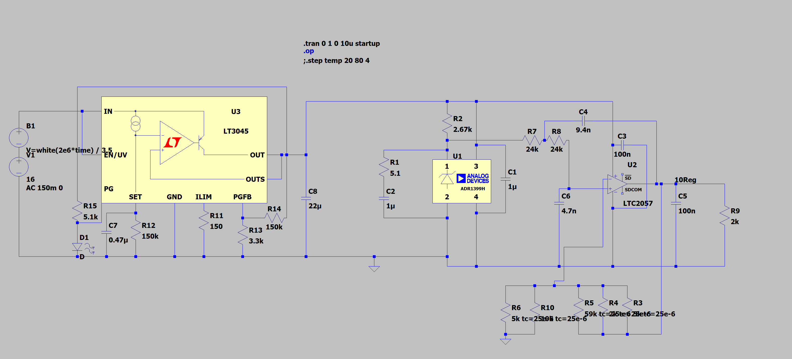
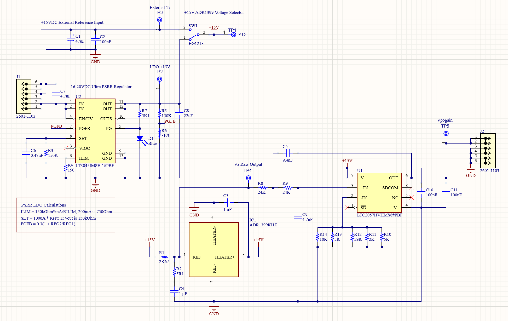
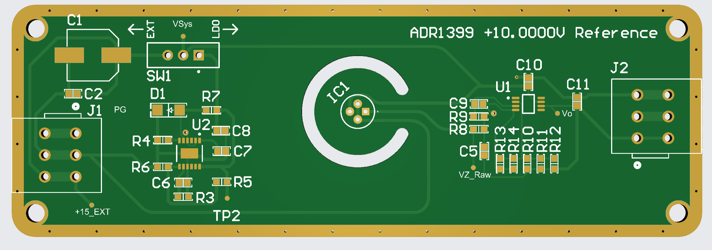
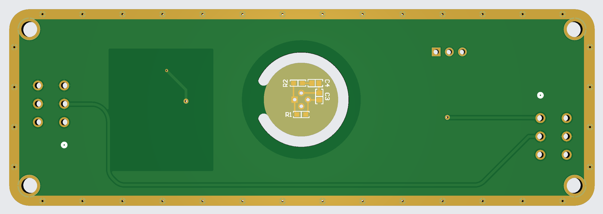

This project aims to develop a basic, relatively cheap, but accurate ultrastable +10.0000VDC transfer standard for use in home metrology setups.

# **Background:**

In order to evaluate the accuracy of many DMMs, many references can be used to verify the validity of the measurements that are being made. These usually include current, voltage, and resistance sources. With DC voltage references, the Fluke 732 / 734C are such examples. However for the average hobbyist, these are simply too expensive. Thus, cheaper standards such as the AD584KH can be found online for around 20-50$. However these programmable standards usually have limited accuracy for 5.5 digits meters and above, and temperature coeffecients around the 15ppm/C mark. For 6.5, 7.5, and 8.5 digit meters, I decided to consider the LM399H, ADR1399KHZ, and ADR1000. 

The LM399 was more difficult to obtain, and the ADR1000 would require a much more precise voltmeter, so I decided to select the [ADR1399](https://www.analog.com/media/en/technical-documentation/data-sheets/adr1399.pdf). It is a 7.05V precise oven-compensated zener shunt reference. This has a temperature coeffecient of 0.2ppm/C, which is more favorable compared to the AD584. It is also generally affordable, at around CA$36/unit, which would be fine for a single unit.

# **Design:**

The design of the board is relatively simple:

**Power Supply:** I decided to add the LT3045 in the chance that a linear, low-noise supply is not available when testing. This allows for a +16-20VDC input on the board's input connector which is then fed to the [LT3045](https://www.analog.com/media/en/technical-documentation/data-sheets/lt3045.pdf), which can be selected as the board's main source through a selector switch. The regulator also features a PG (Power Good) indicator. The ultra-high PSRR LDO used here is usually deisgned for RF applications, or applications where low voltage rail noise is needed, along with a settable voltage output. Low noise at this stage is important, else it would usually reflect in the output. 

**Reference:** Not much to be said, the ADR1399 is to be placed far enough from the power supply circuitry as to not have any influence from the thermal changes from the power supply section.

**10V Gain Stage:** This stage consists of a Sallen-Key filter to reduce noise above 1kHz, the LTC2057 Op-Amp, and the feedback resistor network. In LTspice, it was noticed that injected noise on the power rails was making its' way to the output easily, thus I added a 1kHz SK filter on the input of the Op-Amp. The LTC2057 was decided on by various discussions on the EEVblog forums, but the low noise and low drift charecteristics were key. The LTC2057 is also listed under its' applications as designed for high-resolution data acquisition. For the resistor divider, a gain of approximately 1.41844 is required. While it would be possible and favorable to use a resistor network with an external trim resistor, i've opted for a 59k//2k//5k + 10k//5k feedback network combination. This combination provides nearly exactly the required gain.

The design was first simulated in LTSpice to verify its' functionality before implementing the design in Altium:

Initially, a 5mA draw was simulated, which should be more than plenty for this current design. White noise was added on the input to the LDO to simulate the output voltage and find any noise. Equally, a thermal simulation was performed with the tempcos of the various resistor network elements. Note, the tempcos are around 25ppm/C in the simulation, while the resistors used in the design are around 5ppm/C. 

The schematic is as follows:

The board was laid out to prioritize thermal isolation of the ADR1399 from any other potential sources anywhere else on the board such as the LDO and Op-Amp:

**Layout:**

**Physical Board:**

Note: 10VREFv1.zip are the associated gerbers for this project that can be imported directly into the ordering utility of any major manufacturer

Building the boards is relatively simple, the DigiKey BOM is attached in the files for this project, and can be directly imported. The BOM cost w/o the WAGO latch terminals for the input and output side are about CA$75/board, or US$54.78/board. I will opt to test with Banana terminals for testing purposes, and to minimise thermal EMFs for now.

# **Verification:**

Will update this section once I obtain the boards and can begin burning in the ADR1399K
